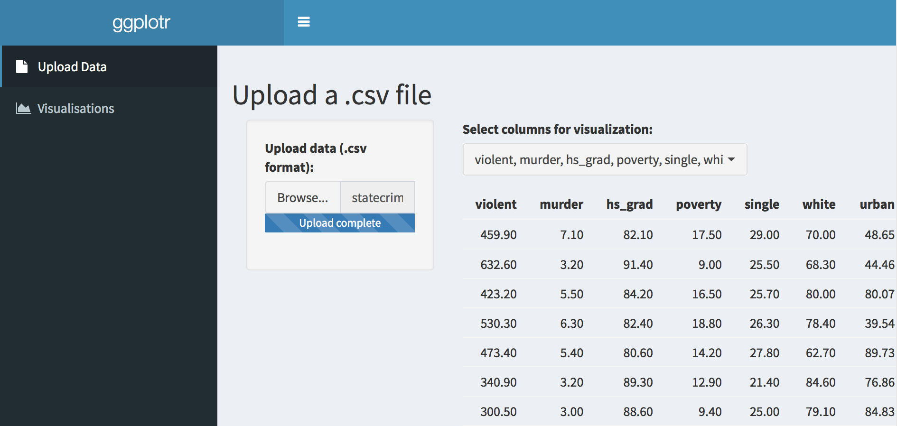
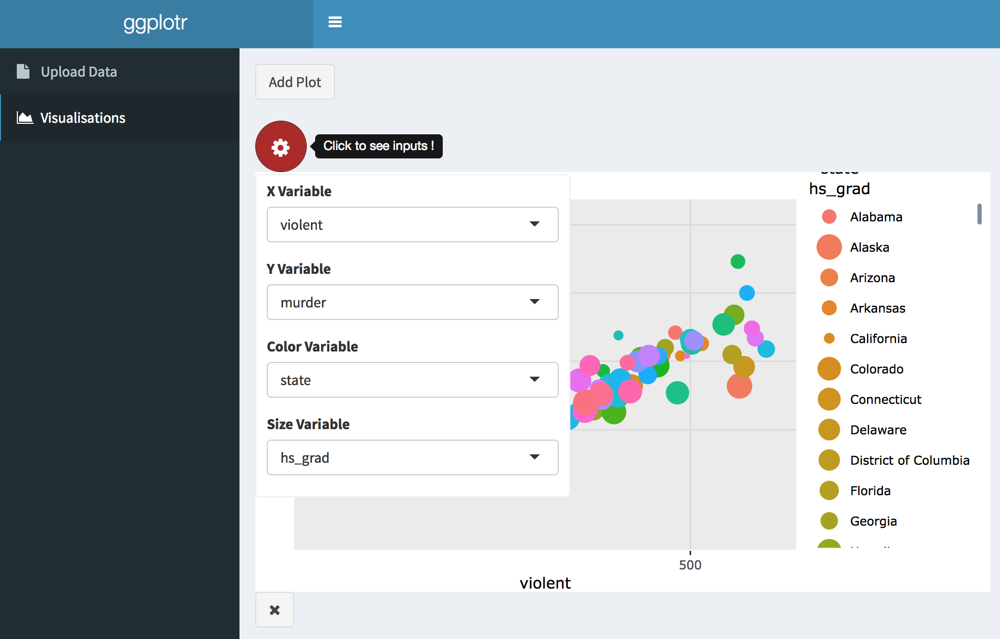

# ggplotr
An RShiny app to quickly look at a csv file and plot it.

Try it at https://gordonm.shinyapps.io/ggplotr/

The demo data included is statecrime.csv from python statsmodels

Written 2018 by Anushi Shah and Gordon McDonald
